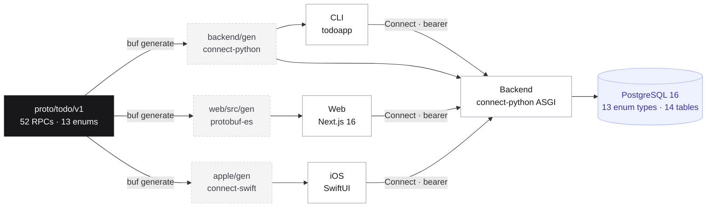
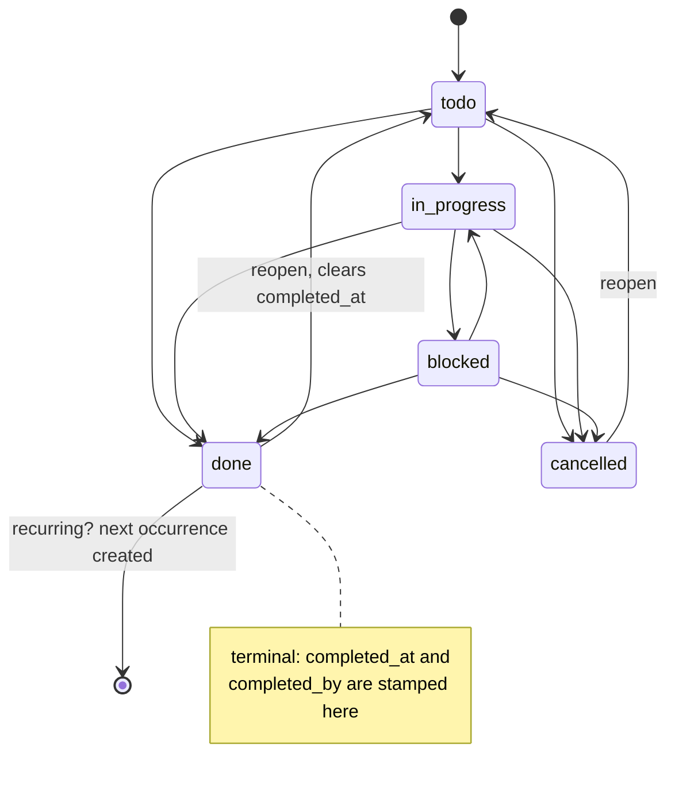
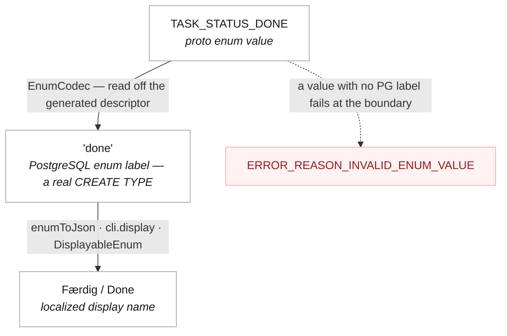
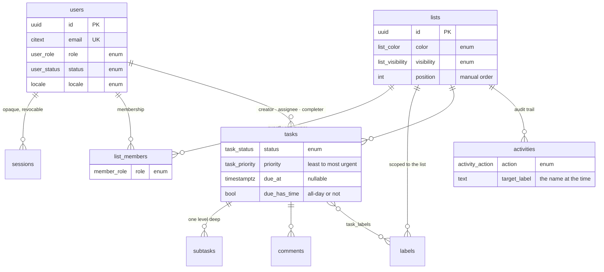
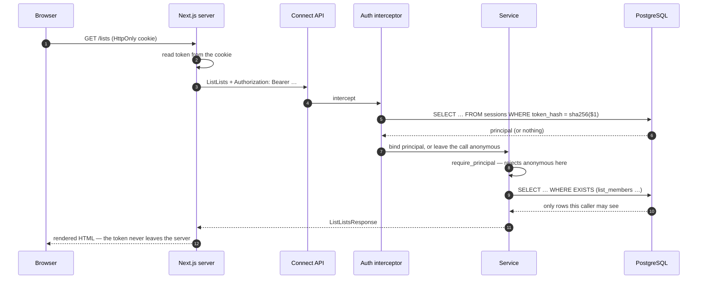
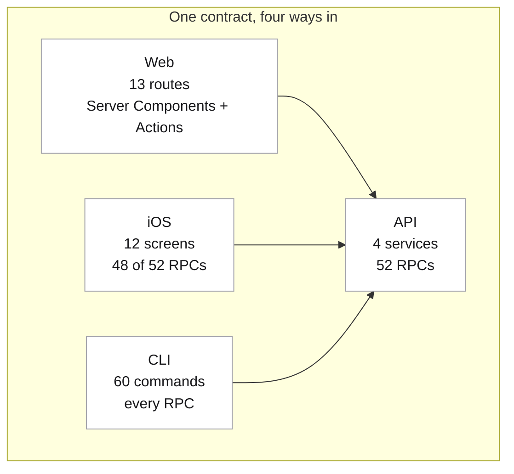

# todoapp

[](https://github.com/rasmusrbj/todoapp/actions/workflows/ci.yml)
[](LICENSE)

A shared todo app, built contract-first: one Protobuf schema, a Python ConnectRPC
backend on PostgreSQL, a Next.js web app, a native iOS app, and a CLI — all speaking the
same API.

It is a real application rather than a demo: four roles enforced in SQL, thirteen enums
carried end to end into a real PostgreSQL type, Danish and English as equals, and an
activity feed that still reads correctly after a rename.



| | |
|---|---|
| `proto/todo/v1/` | the contract: 13 enums, 4 services, 52 RPCs |
| `backend/` | Python 3.12+ · connect-python (ASGI) · psycopg3 · raw SQL |
| `web/` | Next.js 16 · React 19 · Tailwind 4 · next-intl (da/en) |
| `apple/` | SwiftUI · connect-swift · Swift 6 strict concurrency |
| `backend/src/todoapp/cli/` | the `todoapp` command — 60 subcommands |

The dashed boxes are generated by `make generate` and are not committed. Change the
proto, regenerate, and follow the type errors — that is the whole workflow.

## Quick start

You need PostgreSQL 15+, Python 3.12+ with [uv], Node 22+ with pnpm, and [buf].

```bash
make setup     # install deps, generate code, create databases, migrate, seed
make dev       # backend on :8081, web on :3000
```

`make setup` **asks which email and password** you want for the demo admin account. No
credentials are stored in this repository; the pair you choose is written to
`.demo-account.env`, which is gitignored and which the CLI and iOS end-to-end targets
read. Two collaborator accounts come with it — `partner@example.com` and
`colleague@example.com`, same password — so sharing, assignment and comment threads have
somebody else in them.

Open <http://localhost:3000> and sign in with the account you chose.

`make help` lists every target. If you would rather not install PostgreSQL, `make
docker-up` starts one on port 5433.

### Two things a fresh clone cannot build

- **The web app needs a Font Awesome Pro licence.** `web/.npmrc` reads
  `${FONTAWESOME_NPM_TOKEN}`; without it, `pnpm install` in `web/` fails. The backend, the
  CLI and the iOS app are unaffected.
- **The iOS app needs macOS and Xcode 26.** Simulator builds need nothing else; a device
  build needs your own Apple Developer team — `make ios-signing TEAM=ABCDE12345`.

## What it does

- **Lists** with a colour, a visibility (private / shared / public), archiving, manual
  ordering, and per-list labels.
- **Sharing** by email, with four roles — owner, editor, commenter, viewer — enforced in
  SQL rather than in the UI.
- **Tasks** with status, priority, assignee, labels, a due date that may or may not carry
  a time of day, a start date, an estimate, a checklist, comments, and repeat rules that
  spawn the next occurrence when you tick one off.
- **Filtering** by status, priority, label, assignee, due range, overdue, and free text,
  with per-status counts and cursor pagination.

A task's status is a state machine the server owns — completing one stamps the metadata
and, if it repeats, creates the next occurrence in the same transaction:


- **An activity feed** that survives renames and deletions, because it stores what the
  target was called at the time.
- **Email and password auth**: Argon2id, opaque server-side sessions, per-address rate
  limiting, email verification, password reset, and a device list you can revoke from.
- **Danish and English** throughout, including enum labels, error messages, dates, and
  the two transactional emails.
- **An admin area** for accounts: roles, suspension with a reason, creation.

## Architecture

### The contract comes first

`proto/todo/v1/` defines everything. `make generate` writes Python into `backend/gen/`
and TypeScript into `web/src/gen/`; neither is committed. Change the proto, regenerate,
and follow the type errors.

### Enums, all the way down

Every closed set of values is a real enum in four places, and the mapping between them is
*derived*, never hand-written:



A proto value with no PostgreSQL label fails at the boundary rather than silently
storing a default, and `tests/test_enum_parity.py` asserts the label sets — and their
declaration order — match `pg_enum` exactly. Order matters: `task_priority` is declared
least to most urgent so `ORDER BY priority DESC` is meaningful without a lookup table.

### SQL is the data layer

No ORM. Queries live as text in `backend/src/todoapp/repositories/`, rows come back as
dicts, and the schema is the contract. That is a deliberate trade: it costs a mapper
layer (`services/mappers.py`) and buys queries you can read, `EXPLAIN`, and paste into
`psql`.

Authorization is part of the query, not a check after it:

```sql
EXISTS (SELECT 1 FROM list_members m WHERE m.list_id = l.id AND m.user_id = %(viewer_id)s)
  OR l.visibility = 'public'
  OR %(viewer_is_admin)s
```

There is no request shape that returns a list the caller may not see. A list they cannot
reach is reported as `NOT_FOUND`, never `PERMISSION_DENIED`, so the API does not disclose
that someone else's data exists.

The database also holds the invariants the application would otherwise have to remember:
a `CHECK` ties `completed_at` to the terminal statuses, a partial unique index enforces
exactly one owner per list, and `updated_at` is maintained by a trigger.



Every column marked *enum* is a real PostgreSQL type, not a `TEXT` with a `CHECK`.

### Errors are data

A failure carries a machine-readable `ErrorReason` as a Protobuf detail. The
`ConnectError` message is English developer text for logs; clients translate the reason,
so the same failure reads natively in Danish and English and adding a locale needs no
server change. `errors.proto` is the whole vocabulary.

### The token never reaches the browser

Sessions are opaque and server-side — revocation is one `UPDATE`, and only the SHA-256 of
a token is stored. The web app keeps that token in an `HttpOnly` cookie on the *Next.js*
origin and attaches it as a bearer header when the server calls the API. So:

- no token in `document.cookie`, and an XSS bug cannot read it;
- no cross-origin cookie, so no CORS between `:3000` and `:8081`;
- Server Components fetch directly, with no client-side round trip.



Writes go through Server Actions. `web/src/lib/api.ts` is `server-only`, which makes
importing it into a Client Component a build error rather than a leak.

### Localization is not a layer you add later

The locale lives in a cookie, so there is one canonical path per screen and switching
language does not change the URL you would share. The server reads it before the first
byte — no flash of the wrong language. Enum display names live in
`web/messages/{da,en}.json` and are mirrored in `backend/src/todoapp/cli/display.py`, so
the browser and the terminal call the same thing by the same name.

Both languages are written natively. "Haster" is what a Dane would say; it is not a
translation of "Urgent".

## The four clients



Each one is a first-class client, not a thin wrapper: the CLI reaches every RPC, the iOS
app reaches all but four (two need a universal-link handler, two are redundant), and the
web app covers every screen. `make ios-screenshots` renders the iOS app's ten screens to
`apple/screenshots/`.

## The CLI

Installed with the backend as `todoapp`. A pure API client — it holds no database
credentials and cannot bypass an authorization check.

```bash
todoapp auth login --email you@example.com
todoapp lists ls
todoapp tasks list --open --overdue
todoapp tasks add "Køb mælk" --list ind --due tomorrow --priority high --subtask "Havremælk"
todoapp tasks get 4f2c              # any unique id prefix works
todoapp tasks done 4f2c             # rolls a repeat forward and tells you
todoapp lists share 7a1b --email kollega@eksempel.dk --role editor
todoapp tasks list --json | jq '.tasks[].title'
```

Every command takes `--json`, `--locale da|en`, and `--server`. Exit codes are meant to
be branched on: `0` success, `1` the request failed, `2` bad usage, `3` not signed in or
not allowed.

## Testing

```bash
make test         # 173 backend tests, against a real PostgreSQL
make ios-test     # 29 Swift tests + a launch smoke test
make cli-coverage # all 60 CLI commands against a running server
make check        # what CI runs: lint, backend tests, web build
```

The suite runs against a real PostgreSQL (`todoapp_test`, dropped and recreated per
session) and calls the app over the wire through httpx's ASGI transport. Nothing below
the RPC boundary is mocked, which is the only way a raw-SQL repository layer is actually
covered — the tests exercise the same queries, constraints, and enum types production
does.

What it checks, beyond the happy paths: that a wrong password and an unknown address are
indistinguishable; that sign-in is rate limited; that suspending an account invalidates
the session already in someone's hand; that a viewer cannot write and a commenter cannot
edit; that an editor cannot change visibility or share; that completing a repeating task
twice does not create two follow-ups; that 31 January plus a month is 28 February; and
that the proto and PostgreSQL enums agree.

## Layout

```
proto/todo/v1/
  enums.proto          every closed set of values
  errors.proto         ErrorReason — the client's translation keys
  common.proto         pagination, denormalised refs
  user.proto  auth.proto  list.proto  task.proto

backend/src/todoapp/
  main.py              ASGI router: four Connect apps, CORS, health
  config.py            pydantic-settings
  errors.py            typed ConnectError constructors
  mail.py              the two transactional emails, da/en
  auth/                passwords, tokens, principal, interceptors, permissions
  db/                  pool, migration runner, migrations/, seed
  domain/              enum codecs, validation, recurrence
  repositories/        raw SQL, one module per aggregate
  services/            the four RPC services, plus mappers
  cli/                 the `todoapp` command
backend/tests/         173 tests

web/src/
  app/                 routes: (auth), (app), verify-email
  app/actions/         Server Actions — the only write path
  components/          UI, including ui/ from ui.happenings.social
  i18n/  lib/          locale resolution, API clients, formatting
web/messages/          da.json, en.json

apple/
  project.yml          XcodeGen source of truth — the .xcodeproj is generated
  Core/                config, keychain, Connect client, session token, enums
  DesignSystem/        Theme, Components, FlowLayout — app-agnostic
  Apps/Todo/iOS/       App/, Features/<area>/, Components/
  Apps/Todo/Resources/ Localizable.xcstrings — 353 keys × da/en
  Apps/Todo/Tests/     Swift Testing + a fake Connect transport
```

## Conventions

- **Python**: Google style. Ruff for lint and format, Google-convention docstrings,
  annotations everywhere. `make format`.
- **SQL**: lower case keywords in identifiers, explicit casts on every placeholder,
  forward-only checksummed migrations.
- **TypeScript**: `strict` plus `noUncheckedIndexedAccess`. Server Components by default;
  `'use client'` only where interaction demands it.
- **UI**: the Happenings design system — borders over shadows, `rounded-xl` cards,
  `cursor-pointer` and a scale-down press on everything clickable, Font Awesome Pro,
  light and dark for every view.

## Notes for whoever comes next

- The backend listens on **8081**. On macOS, 8080 is usually WhatsApp Desktop.
- `buf generate` runs with `clean: true`, so its output directories are wiped each time.
  They must contain only generated code — that is why Python lands in `backend/gen/`
  rather than next to the hand-written package.
- `.claude/skills/todoapp/` holds a skill describing the invariants and the traps, for
  agent-assisted work in this repo. `apple/AGENTS.md` does the same for the iOS app.
- No credential is hardcoded anywhere. If you find one, that is a bug — see
  [SECURITY.md](SECURITY.md).

## Contributing

Pull requests are welcome. [CONTRIBUTING.md](CONTRIBUTING.md) covers the setup, the five
rules that keep the four clients honest with each other, and what a review looks for.
Please also read the [Code of Conduct](CODE_OF_CONDUCT.md).

For a security issue, do not open a public issue — see [SECURITY.md](SECURITY.md).

## Licence

[MIT](LICENSE) © Rasmus Rou Bach Jensing and Happenings Group A/S.

[uv]: https://docs.astral.sh/uv/
[buf]: https://buf.build/docs/installation
